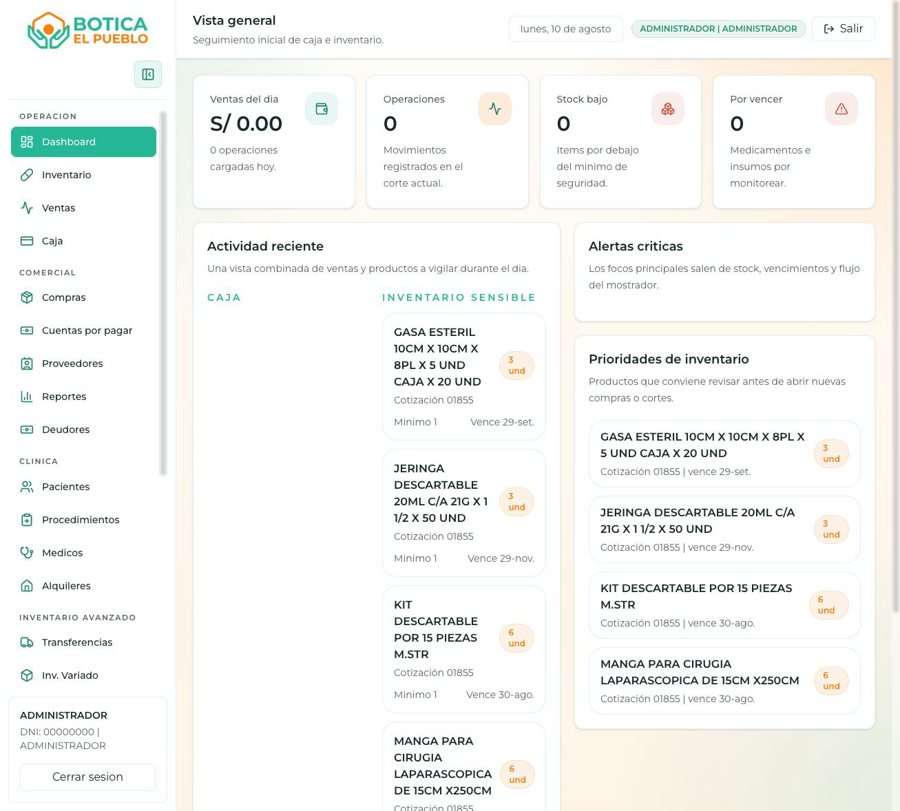
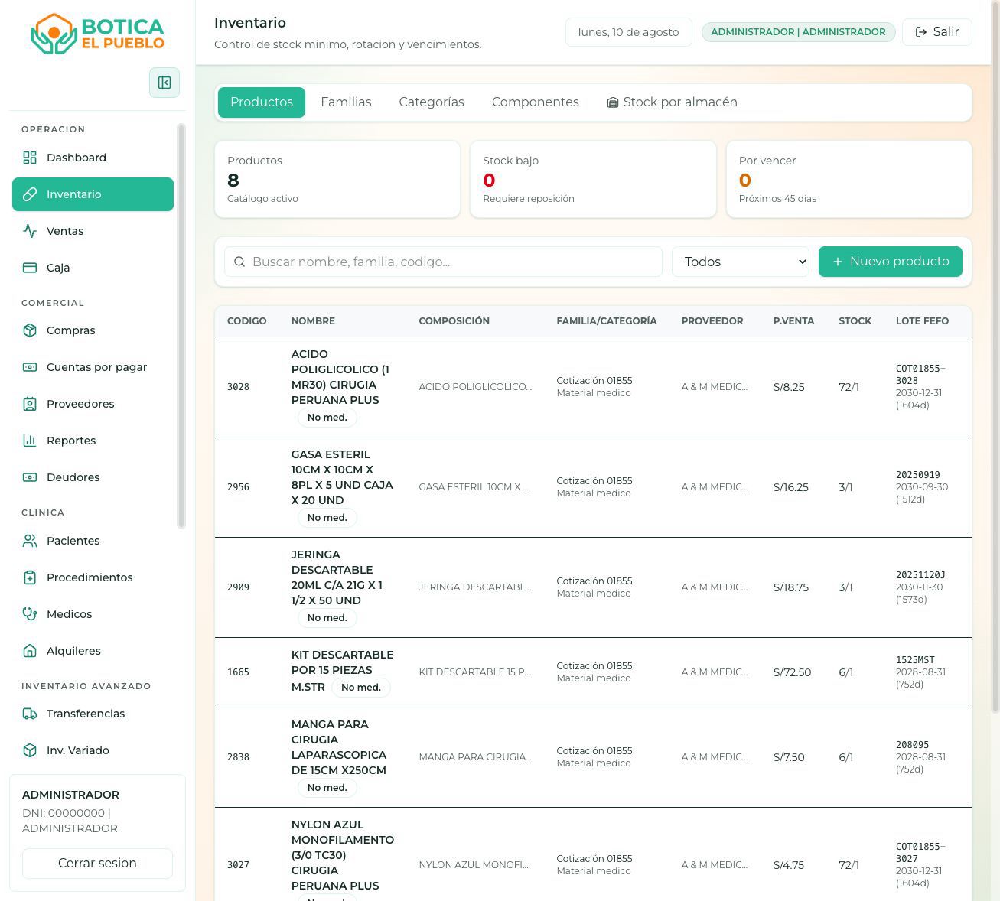
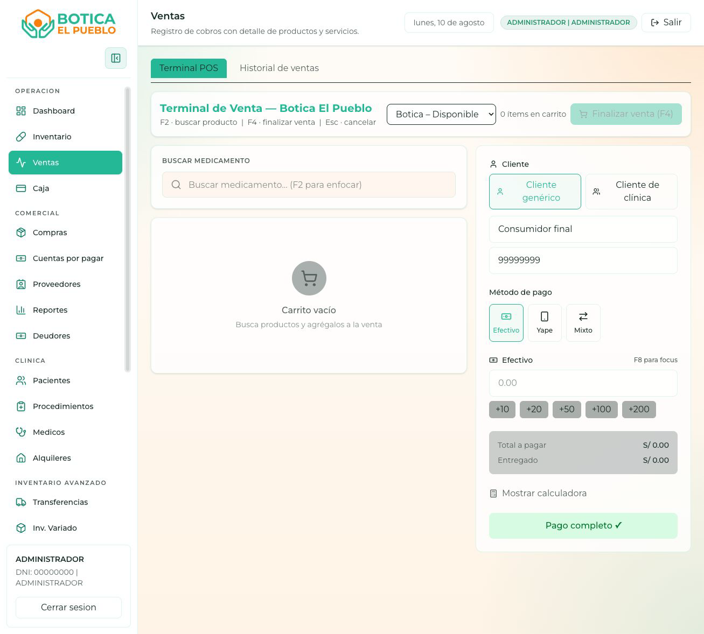
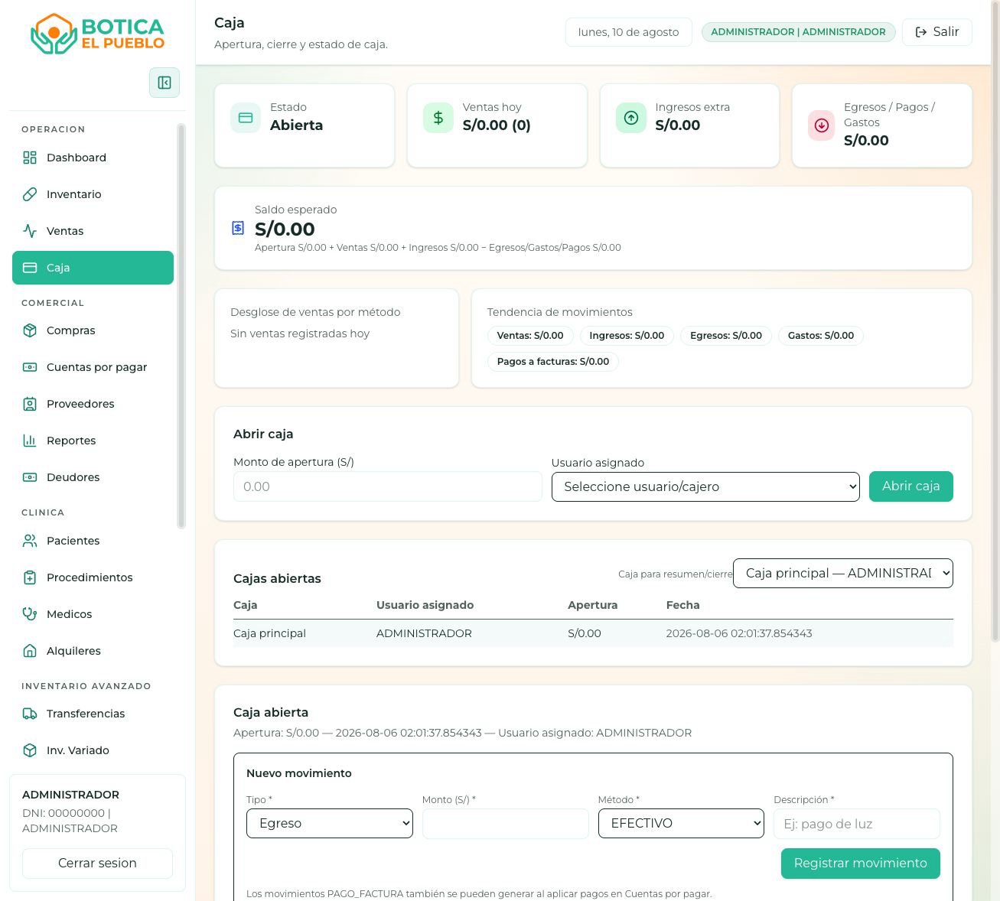
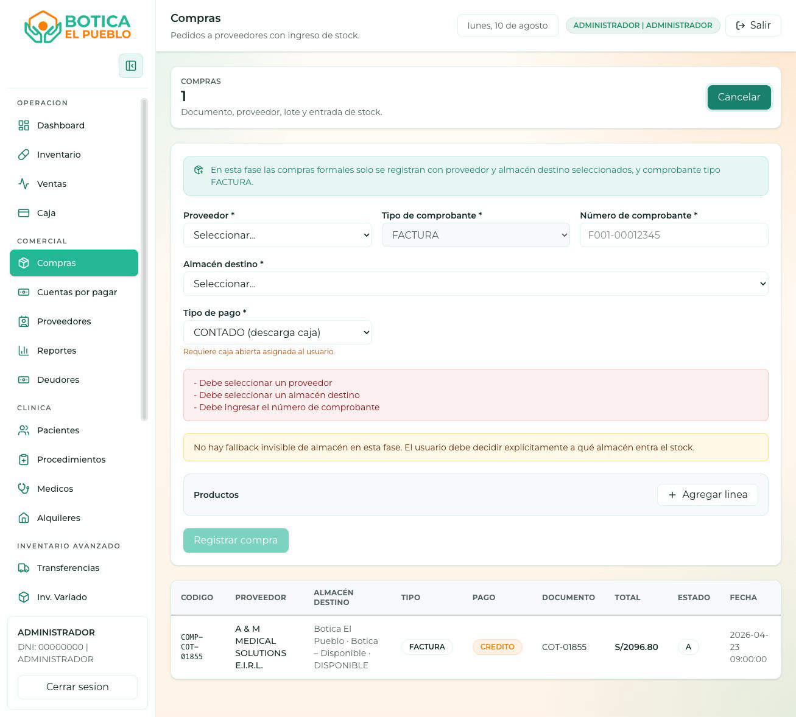
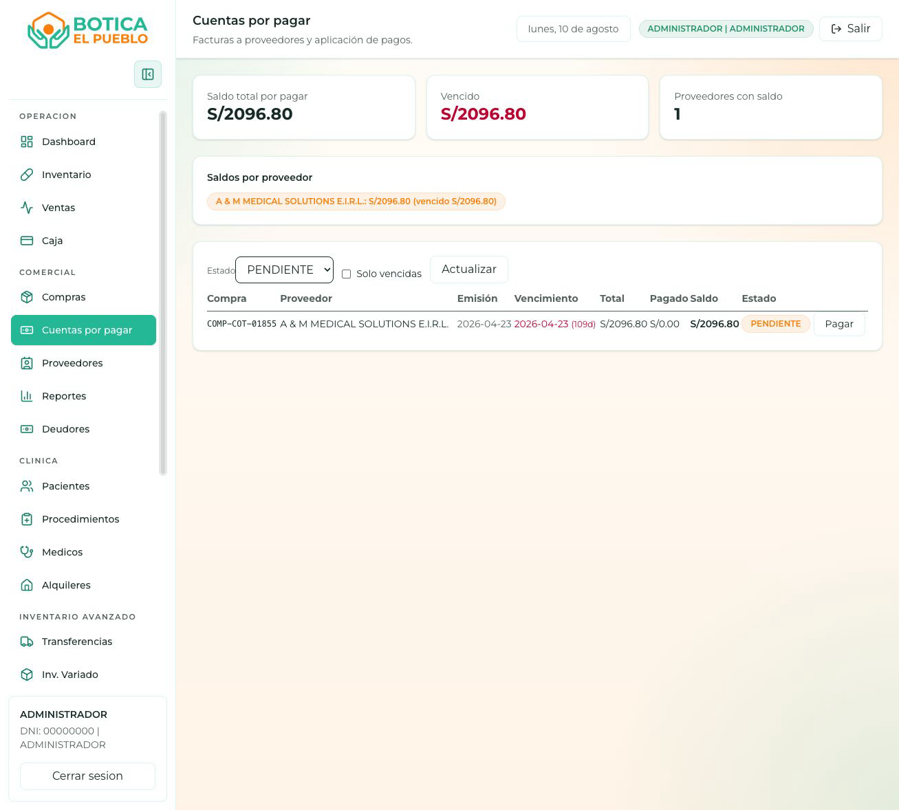
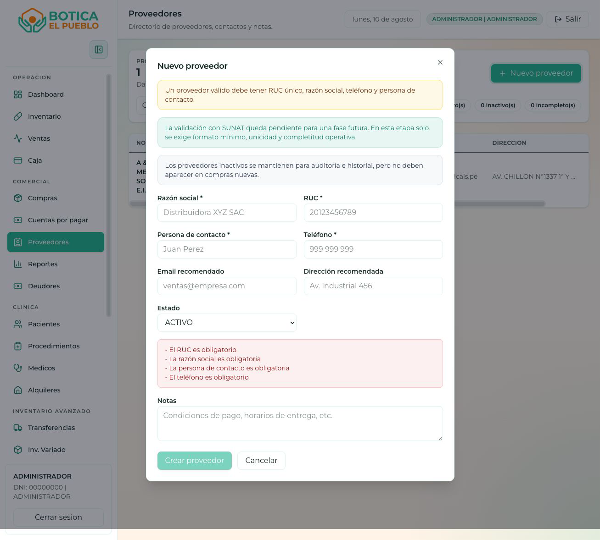
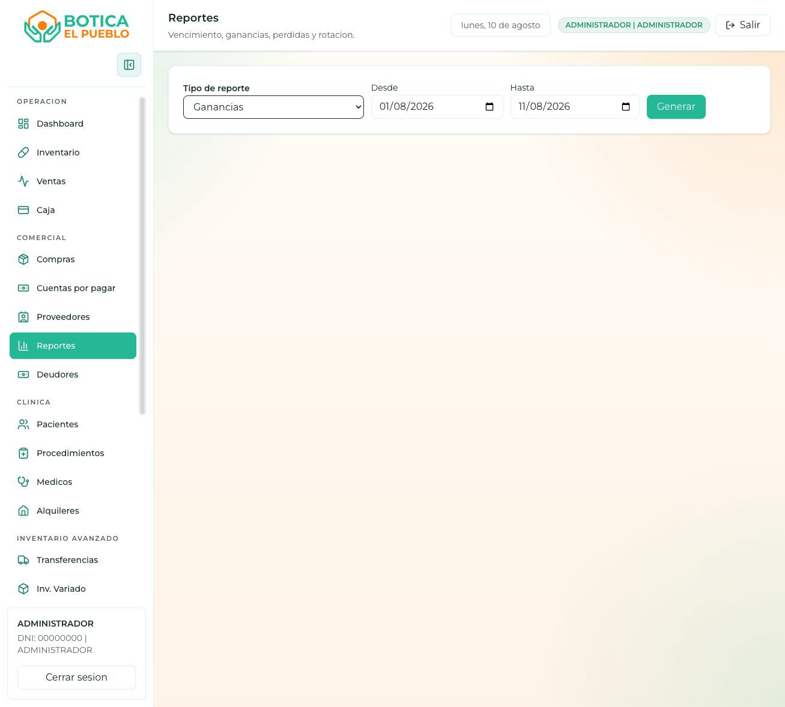
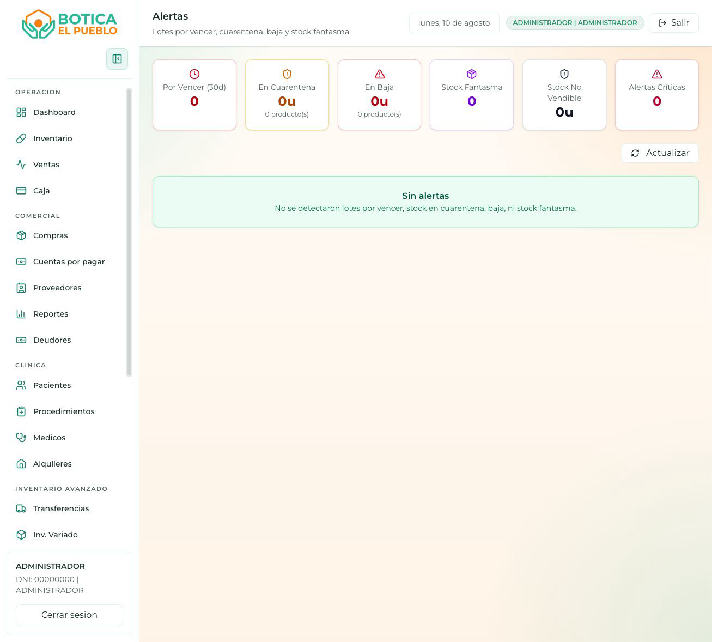
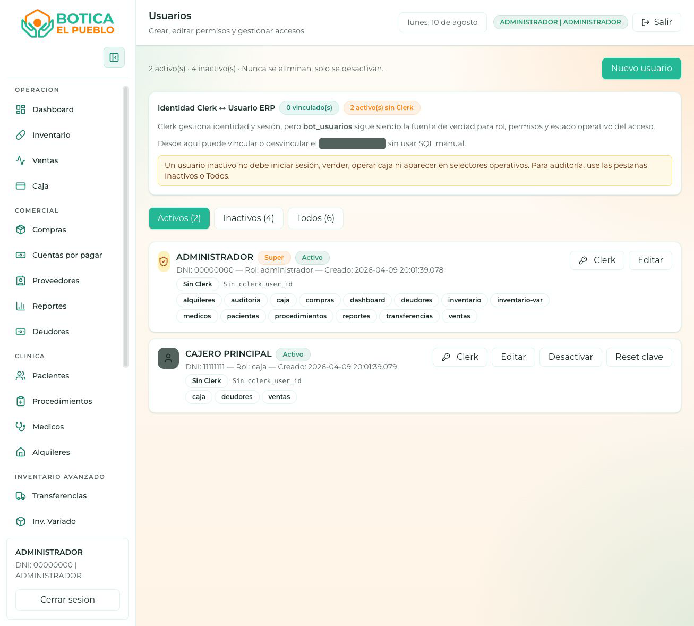

# Manual de Usuario - Botica El Pueblo

Fecha de actualización: 2026-08-11  
Sistema: ERP Botica El Pueblo  
Dirigido a: cajeros, administradores, almacén, compras, clínica y gerencia.

Este manual incluye capturas reales del sistema para ubicar visualmente cada módulo principal.

## 1. Objetivo del sistema

Botica El Pueblo permite operar una farmacia con control de caja, ventas, inventario, lotes, vencimientos, compras, proveedores, cuentas por pagar, deudores, clínica, reportes y administración de usuarios.

El sistema busca que cada operación importante deje registro:

- Quién realizó la acción.
- En qué fecha y hora se hizo.
- Qué producto, lote, caja, proveedor, usuario o documento fue afectado.
- Qué stock, dinero o cuenta cambió.

## 2. Acceso al sistema

### 2.1 Ingresar

1. Abrir la URL entregada por el administrador.
2. En la pantalla de inicio, ingresar DNI.
3. Ingresar contraseña.
4. Presionar `Ingresar`.

Si los datos son correctos, el sistema abre el panel principal o el primer módulo permitido para el usuario.

### 2.2 Cerrar sesión

1. Ir al menú lateral.
2. Presionar `Cerrar sesión`.
3. Confirmar que vuelve a pantalla de inicio.

### 2.3 Si no puede ingresar

Revise:

- DNI con 8 dígitos.
- Contraseña correcta.
- Usuario activo.
- Permisos asignados.
- Conexión del servidor.

Si sigue fallando, pedir al administrador que revise el módulo `Usuarios`.

## 3. Permisos y roles

El sistema muestra solo los módulos permitidos para cada usuario.

Tipos principales:

- `Super usuario`: acceso completo.
- `Administrador`: acceso completo y gestión operativa.
- `Usuario con permisos`: acceso solo a módulos asignados.

Reglas importantes:

- `Mi Perfil` está disponible para todo usuario logueado.
- Solo administrador o super usuario puede gestionar usuarios.
- Solo administrador o super usuario debe abrir/cerrar caja.
- Un cajero necesita una caja abierta y asignada para vender.
- Si un módulo no aparece, el usuario no tiene permiso para verlo.

## 4. Navegación general

El menú lateral se organiza por grupos:

- `Operación`: Dashboard, Inventario, Ventas, Caja.
- `Comercial`: Compras, Cuentas por pagar, Proveedores, Deudores, Reportes.
- `Clínica`: Pacientes, Procedimientos, Médicos, Alquileres.
- `Inventario avanzado`: Transferencias, Inventario variado, Almacenes, Traslados, Devoluciones, Consistencia, Alertas.
- `Administración`: Usuarios, Locales, Auditoría, Mi Perfil.

En escritorio, el menú puede mostrarse completo o colapsado. En móvil, se abre con el botón de menú.

## 5. Flujo diario recomendado

### 5.1 Inicio del día

1. Administrador ingresa al sistema.
2. Ir a `Caja`.
3. Abrir caja con monto inicial.
4. Asignar caja al usuario/cajero.
5. Revisar `Dashboard`.
6. Revisar `Alertas` por vencimientos o stock crítico.
7. Revisar `Inventario` si hay productos sensibles.

### 5.2 Durante el día

1. Cajero registra ventas desde `Ventas`.
2. Encargado registra compras desde `Compras`.
3. Administrador revisa caja, movimientos, egresos y pagos.
4. Almacén registra traslados, devoluciones o transferencias cuando corresponda.
5. Gerencia revisa reportes.

### 5.3 Cierre del día

1. Ir a `Caja`.
2. Revisar ventas del día.
3. Revisar ingresos, egresos, gastos y pagos de factura.
4. Verificar saldo esperado.
5. Cerrar caja desde usuario administrador.
6. Revisar `Reportes` si se requiere informe del día.

## 6. Dashboard

Ruta: `Panel > Dashboard`

Muestra resumen operativo:

Figura 1. Dashboard general con métricas, actividad reciente, inventario sensible y alertas.

- Ventas del día.
- Número de operaciones.
- Productos con stock bajo.
- Productos por vencer.
- Actividad reciente.
- Inventario sensible.
- Alertas críticas.
- Ruta operativa sugerida.

Uso recomendado:

1. Revisar al iniciar turno.
2. Priorizar productos con stock bajo.
3. Revisar vencimientos cercanos.
4. Usar como pantalla de control rápido.

## 7. Inventario

Ruta: `Panel > Inventario`

Permite gestionar productos, catálogos y distribución.

Figura 2. Inventario principal con pestañas, indicadores, filtros y tabla de productos.

### 7.1 Productos

Funciones:

- Buscar producto por nombre, código, genérico o laboratorio.
- Filtrar por estado: todos, bajo stock, por vencer, estable.
- Crear producto.
- Editar producto.
- Editar precios.
- Ver historial de precios.
- Ir a compras cuando falta stock.

Datos comunes de producto:

- Código.
- Nombre.
- Genérico.
- Familia.
- Categoría.
- Presentación.
- Marca o laboratorio.
- Stock mínimo.
- Precios de venta.
- Reglas de lote y vencimiento.
- Proveedor.

### 7.2 Crear producto

1. Entrar a `Inventario`.
2. Presionar `Nuevo producto`.
3. Completar datos obligatorios.
4. Definir precios.
5. Definir si requiere lote y vencimiento.
6. Guardar.

Recomendación: si el producto se compra por lote, mantener activado control de lote y vencimiento.

### 7.3 Editar precios

1. Buscar producto.
2. Presionar acción de precio.
3. Ingresar nuevos precios.
4. Guardar.
5. Revisar `Historial de precios` si se necesita auditoría.

### 7.4 Familias, categorías y componentes

Estas pestañas sirven para ordenar el catálogo:

- `Familias`: grupos grandes de productos.
- `Categorías`: clasificación secundaria.
- `Componentes`: principio activo o componente relevante.

Uso:

1. Abrir pestaña correspondiente.
2. Crear o editar registro.
3. Guardar.
4. Luego usarlo en productos.

### 7.5 Distribución

La pestaña `Distribución` muestra stock por local, almacén y lote.

Sirve para:

- Ver dónde está un producto.
- Revisar lote disponible.
- Confirmar stock antes de vender o trasladar.
- Detectar diferencias entre almacenes.

## 8. Ventas

Ruta: `Panel > Ventas`

Tiene dos pestañas:

Figura 3. Punto de venta para buscar productos, armar carrito y registrar pago.

- `POS`: registrar venta.
- `Historial`: revisar y anular ventas.

### 8.1 Antes de vender

Debe existir una caja abierta y asignada al usuario. Si no hay caja, la venta puede fallar con mensaje similar a:

`NO HAY CAJA ABIERTA. Abra caja antes de registrar ventas.`

### 8.2 Registrar venta POS

1. Entrar a `Ventas`.
2. Elegir almacén de venta si aparece el selector.
3. Buscar producto. Atajo: `F2`.
4. Seleccionar producto.
5. Confirmar cantidad.
6. Elegir precio si el producto tiene varios precios.
7. Repetir hasta completar carrito.
8. Seleccionar cliente:
   - `Cliente genérico`.
   - `Cliente de clínica`.
9. Elegir método de pago:
   - `Efectivo`.
   - `Yape`.
   - `Mixto`.
10. Ingresar monto recibido.
11. Revisar vuelto o saldo pendiente.
12. Presionar confirmar venta.

### 8.3 Pago efectivo

El sistema permite ingresar monto recibido. Si el efectivo supera el total, calcula vuelto.

Ejemplo:

- Total: S/ 37.50.
- Recibe: S/ 50.00.
- Vuelto: S/ 12.50.

### 8.4 Pago Yape

El sistema coloca el total como monto digital.

Uso:

1. Elegir `Yape`.
2. Confirmar que el cliente realizó pago.
3. Registrar venta.

### 8.5 Pago mixto

El usuario ingresa monto efectivo. El sistema calcula el saldo digital pendiente.

Ejemplo:

- Total: S/ 100.00.
- Efectivo: S/ 40.00.
- Digital pendiente: S/ 60.00.

### 8.6 Alertas durante venta

Al agregar productos, el sistema puede mostrar:

- Stock bajo.
- Producto vencido o por vencer.
- Producto requiere receta.
- Producto sin stock.
- Producto sin precio.

No ignore alertas críticas. Verifique antes de cobrar.

### 8.7 Historial de ventas

Uso:

1. Entrar a `Ventas`.
2. Ir a pestaña `Historial`.
3. Presionar `Actualizar` si necesita refrescar.
4. Revisar código, cliente, total, método de pago, estado y fecha.

### 8.8 Anular venta

1. Ir a `Historial`.
2. Ubicar venta.
3. Presionar anular.
4. Ingresar motivo obligatorio.
5. Confirmar.

La anulación debe tener motivo claro para auditoría.

## 9. Caja

Ruta: `Panel > Caja`

Controla apertura, cierre, movimientos y saldo esperado.

Figura 4. Caja con estado, ventas del día, saldo esperado, movimientos y cierre.

### 9.1 Abrir caja

Solo administrador o super usuario.

1. Entrar a `Caja`.
2. Ingresar monto de apertura.
3. Seleccionar usuario/cajero asignado.
4. Presionar `Abrir caja`.

### 9.2 Revisar caja

La pantalla muestra:

- Estado de caja.
- Ventas de hoy.
- Ingresos extra.
- Egresos, gastos y pagos.
- Saldo esperado.
- Desglose por método de pago.
- Cajas abiertas.
- Movimientos.

Fórmula del saldo esperado:

`Apertura + Ventas + Ingresos - Egresos/Gastos/Pagos`

### 9.3 Registrar movimiento manual

Tipos:

- `Ingreso extra`.
- `Egreso`.
- `Gasto`.
- `Pago a factura`.

Métodos:

- `EFECTIVO`.
- `TARJETA`.
- `TRANSFERENCIA`.
- `YAPE`.
- `PLIN`.
- `OTRO`.

Pasos:

1. Seleccionar tipo de movimiento.
2. Ingresar monto.
3. Seleccionar método de pago.
4. Escribir descripción.
5. Guardar.

### 9.4 Anular movimiento de caja

1. Ubicar movimiento.
2. Presionar anular.
3. Escribir motivo.
4. Confirmar.

### 9.5 Cerrar caja

Solo administrador o super usuario.

1. Seleccionar caja si hay varias.
2. Revisar movimientos.
3. Revisar saldo esperado.
4. Presionar `Cerrar caja automática`.

## 10. Compras

Ruta: `Panel > Compras`

Registra ingreso de stock desde proveedores.

Figura 5. Registro de compra con proveedor, documento, almacén destino, pago y productos.

### 10.1 Requisitos

- Proveedor activo.
- Almacén destino activo.
- Documento tipo `FACTURA`.
- Número de comprobante.
- Al menos un producto.
- Lote y vencimiento cuando el producto lo requiere.

### 10.2 Registrar compra

1. Entrar a `Compras`.
2. Presionar `Nueva compra`.
3. Seleccionar proveedor.
4. Confirmar tipo de comprobante `FACTURA`.
5. Ingresar número de comprobante.
6. Seleccionar almacén destino.
7. Elegir tipo de pago:
   - `CONTADO`: descarga caja.
   - `CREDITO`: genera cuenta por pagar.
8. Si es crédito, ingresar fecha de vencimiento de factura.
9. Agregar línea de producto.
10. Seleccionar producto.
11. Ingresar cantidad.
12. Ingresar precio unitario.
13. Ingresar lote.
14. Ingresar fecha de vencimiento.
15. Guardar compra.

### 10.3 Compra contado

Requiere caja abierta asignada al usuario. Si no hay caja, el registro puede fallar.

### 10.4 Compra crédito

Genera una cuenta por pagar. Luego se gestiona en `Cuentas por pagar`.

## 11. Cuentas por pagar

Ruta: `Panel > Cuentas por pagar`

Sirve para controlar facturas pendientes de proveedores.

Figura 6. Cuentas por pagar para revisar facturas, saldos, vencimientos y pagos.

Funciones:

- Ver facturas pendientes.
- Ver resumen por proveedor.
- Identificar vencidos.
- Registrar pago.

### 11.1 Registrar pago

1. Ubicar cuenta pendiente.
2. Presionar `Pagar`.
3. Ingresar monto.
4. Indicar documento o referencia.
5. Agregar notas si corresponde.
6. Confirmar pago.

Si el pago sale de caja, revise luego `Caja`.

## 12. Proveedores

Ruta: `Panel > Proveedores`

Administra proveedores disponibles para compras.

Figura 7. Proveedores con buscador, estados, formulario y datos fiscales.

### 12.1 Crear proveedor

1. Presionar `Nuevo proveedor`.
2. Ingresar razón social.
3. Ingresar RUC de 11 dígitos.
4. Ingresar persona de contacto.
5. Ingresar teléfono.
6. Opcional: email, dirección y notas.
7. Definir estado.
8. Guardar.

### 12.2 Editar proveedor

1. Buscar por nombre o RUC.
2. Presionar `Editar`.
3. Modificar datos.
4. Guardar.

Notas:

- Proveedor inactivo se conserva para historial.
- Proveedor inactivo no debe usarse para compras nuevas.
- Validación SUNAT puede estar pendiente según fase del sistema.

## 13. Deudores

Ruta: `Panel > Deudores`

Controla cuentas por cobrar.

### 13.1 Crear deuda

1. Presionar `Nuevo deudor`.
2. Ingresar nombre.
3. Ingresar DNI.
4. Ingresar teléfono.
5. Ingresar concepto.
6. Ingresar monto.
7. Ingresar vencimiento.
8. Guardar.

### 13.2 Registrar abono

1. Ubicar deudor.
2. Presionar `Abonar`.
3. Ingresar monto.
4. Confirmar.

## 14. Reportes

Ruta: `Panel > Reportes`

Tipos disponibles:

Figura 8. Reportes con selección de tipo, fechas y generación de información.

- `Ganancias`.
- `Utilidad por venta`.
- `Vencimiento`.
- `Faltantes`.
- `Rotación`.
- `Pérdidas`.

### 14.1 Generar reporte

1. Seleccionar tipo de reporte.
2. Completar fechas o días cuando corresponda.
3. Presionar `Generar`.
4. Revisar resultados.

### 14.2 Uso de cada reporte

- `Ganancias`: ventas, costo real vendido y ganancia.
- `Utilidad por venta`: ingreso, costo, utilidad, margen y líneas sin costo.
- `Vencimiento`: lotes próximos a vencer según días indicados.
- `Faltantes`: productos bajo stock mínimo.
- `Rotación`: familias, stock total y valor de inventario.
- `Pérdidas`: productos vencidos y pérdida estimada.

## 15. Pacientes

Ruta: `Panel > Pacientes`

Administra pacientes de clínica.

### 15.1 Registrar paciente

1. Ingresar nombre completo.
2. Ingresar documento.
3. Ingresar edad.
4. Ingresar teléfono.
5. Guardar.

Los pacientes pueden usarse luego en ventas como `Cliente de clínica`.

## 16. Procedimientos

Ruta: `Panel > Procedimientos`

Permite programar atenciones o procedimientos.

Datos comunes:

- Paciente.
- Doctor.
- Sala.
- Procedimiento.
- Fecha y hora.

Uso:

1. Completar datos.
2. Guardar.
3. Revisar agenda o estado.

## 17. Médicos y servicios

Ruta: `Panel > Médicos`

Incluye dos registros:

- Médicos.
- Servicios clínicos.

### 17.1 Registrar médico

1. Presionar `+ Médico`.
2. Ingresar nombre.
3. Opcional: CMP, especialidad, teléfono, email.
4. Guardar.

### 17.2 Registrar servicio

1. Presionar `+ Servicio`.
2. Ingresar nombre del servicio.
3. Opcional: categoría, precio y descripción.
4. Guardar.

## 18. Alquileres

Ruta: `Panel > Alquileres`

Controla consultorios o espacios alquilados.

### 18.1 Registrar alquiler

1. Presionar `Nuevo alquiler`.
2. Ingresar concepto.
3. Ingresar arrendatario.
4. Ingresar DNI.
5. Ingresar teléfono.
6. Ingresar monto.
7. Ingresar fecha de inicio y fin.
8. Guardar.

Estados posibles:

- Activo.
- Vencido.
- Finalizado.

## 19. Transferencias

Ruta: `Panel > Transferencias`

Registra movimientos generales de stock.

### 19.1 Registrar transferencia

1. Presionar `Nuevo movimiento`.
2. Ingresar motivo.
3. Ingresar origen.
4. Ingresar destino.
5. Agregar productos.
6. Indicar cantidades.
7. Agregar notas si corresponde.
8. Registrar.

## 20. Inventario variado

Ruta: `Panel > Inventario variado`

Controla activos no farmacéuticos:

- Camillas.
- Equipos.
- Materiales.
- Activos diversos.

### 20.1 Registrar item

1. Presionar `Nuevo item`.
2. Ingresar nombre.
3. Ingresar categoría.
4. Ingresar cantidad.
5. Ingresar valor unitario.
6. Ingresar ubicación.
7. Ingresar descripción.
8. Guardar.

Estados:

- Activo.
- Prestado.
- Inactivo.

## 21. Locales

Ruta: `Panel > Locales`

Administra sedes o sucursales.

### 21.1 Crear local

1. Presionar `Nuevo local`.
2. Ingresar nombre.
3. Ingresar código.
4. Ingresar dirección.
5. Ingresar teléfono.
6. Definir tipo.
7. Guardar.

Tipos frecuentes:

- Botica.
- Clínica.
- Otro.

## 22. Almacenes

Ruta: `Panel > Almacenes`

Administra almacenes por local.

### 22.1 Crear almacén

1. Presionar `Nuevo almacén`.
2. Seleccionar local.
3. Ingresar nombre.
4. Ingresar código.
5. Definir tipo o políticas.
6. Guardar.

Políticas visibles:

- Permite venta.
- Permite consumo clínico.
- Requiere revisión.

## 23. Traslados de almacén

Ruta: `Panel > Traslados`

Sirve para mover stock entre almacenes con control de lote.

### 23.1 Registrar traslado

1. Presionar nuevo traslado.
2. Seleccionar producto.
3. Seleccionar almacén origen.
4. Seleccionar lote disponible.
5. Seleccionar almacén destino.
6. Ingresar cantidad.
7. Ingresar motivo.
8. Confirmar.

Recomendación: validar stock y lote antes de confirmar.

## 24. Devoluciones

Ruta: `Panel > Devoluciones`

Permite registrar devoluciones de cliente o a proveedor.

### 24.1 Devolución de cliente

1. Elegir tipo `Cliente`.
2. Seleccionar producto.
3. Seleccionar almacén.
4. Seleccionar lote si aplica.
5. Ingresar cantidad.
6. Ingresar motivo.
7. Registrar.

Normalmente vuelve a cuarentena o revisión.

### 24.2 Devolución a proveedor

1. Elegir tipo `Proveedor`.
2. Seleccionar producto.
3. Seleccionar almacén.
4. Seleccionar lote.
5. Ingresar cantidad.
6. Ingresar motivo.
7. Registrar.

## 25. Consistencia

Ruta: `Panel > Consistencia`

Sirve para revisar integridad de stock y lotes.

Funciones:

- Ver resumen general.
- Ver inconsistencias de stock.
- Ver lotes vencidos no marcados.
- Ver lotes sin almacén.
- Detectar stock fantasma.
- Simular reconciliación.
- Ejecutar reconciliación.
- Simular marcado de vencidos.
- Ejecutar marcado de vencidos.

Uso recomendado:

1. Primero usar opción de simulación.
2. Revisar resultado.
3. Ejecutar solo si el resultado es correcto.
4. Revisar `Auditoría` luego de cambios importantes.

## 26. Alertas

Ruta: `Panel > Alertas`

Muestra riesgos operativos:

Figura 9. Alertas operativas para vencimientos, cuarentena, baja y stock fantasma.

- Lotes por vencer.
- Stock en cuarentena.
- Stock en baja.
- Stock fantasma.

Uso:

1. Revisar cada mañana.
2. Priorizar lotes con menos días.
3. Coordinar descuentos, devolución, baja o traslado.
4. Revisar cuarentena antes de vender.

## 27. Usuarios

Ruta: `Panel > Usuarios`

Solo administradores o super usuarios.

Figura 10. Administración de usuarios, permisos, estado, Clerk y reset de clave.

### 27.1 Crear usuario

1. Presionar `Nuevo usuario`.
2. Ingresar DNI.
3. Ingresar nombre.
4. Seleccionar rol.
5. Marcar si tendrá poderes de administrador.
6. Seleccionar permisos por módulo.
7. Guardar.

### 27.2 Editar permisos

1. Ubicar usuario.
2. Presionar `Editar`.
3. Marcar o desmarcar módulos.
4. Guardar.

### 27.3 Activar o desactivar usuario

1. Ubicar usuario.
2. Presionar activar/desactivar.
3. Confirmar.

Usuario inactivo no debe operar.

### 27.4 Reset de clave

1. Ubicar usuario.
2. Presionar `Reset clave`.
3. Informar nueva clave al usuario según política interna.
4. Pedir que cambie contraseña desde `Mi Perfil`.

### 27.5 Vinculación Clerk

La vinculación Clerk permite asociar identidad externa con usuario ERP.

Regla importante: Clerk no define permisos. Los permisos reales siguen en `Usuarios`.

## 28. Mi Perfil

Ruta: `Panel > Mi Perfil`

Permite:

- Ver DNI y rol.
- Editar nombre, teléfono, dirección y email.
- Cambiar contraseña.

### 28.1 Cambiar contraseña

1. Abrir `Mi Perfil`.
2. Presionar opción de cambiar clave.
3. Ingresar clave actual.
4. Ingresar nueva clave.
5. Repetir nueva clave.
6. Guardar.

La nueva clave debe coincidir en ambos campos.

## 29. Auditoría

Ruta: `Panel > Auditoría`

Muestra registro de acciones del sistema.

Uso:

- Revisar operaciones sensibles.
- Ver acciones por usuario.
- Revisar cambios posteriores a anulaciones, cierres o ajustes.
- Ayudar a investigar diferencias.

## 30. Buenas prácticas operativas

### 30.1 Caja

- Abrir caja antes de vender.
- No compartir usuario.
- Registrar egresos con descripción clara.
- Cerrar caja al final del turno.
- No anular sin motivo real.

### 30.2 Inventario

- Registrar compras con lote y vencimiento.
- Revisar alertas antes de vender productos sensibles.
- No vender productos en cuarentena.
- Mantener stock mínimo actualizado.
- Revisar distribución por almacén.

### 30.3 Ventas

- Confirmar producto antes de agregar.
- Confirmar precio seleccionado.
- Confirmar método de pago antes de cobrar.
- Revisar vuelto antes de entregar.
- Anular solo cuando corresponda y con motivo claro.

### 30.4 Compras

- Usar proveedor activo.
- Ingresar factura real.
- Revisar almacén destino.
- En crédito, registrar fecha de vencimiento.
- Verificar que la compra aumentó stock.

### 30.5 Usuarios

- Dar permisos mínimos necesarios.
- Desactivar usuarios que ya no operan.
- No compartir claves.
- Cambiar clave si hay sospecha de acceso indebido.

## 31. Problemas frecuentes

### 31.1 No aparece un módulo

Causa probable: usuario sin permiso.

Solución: administrador debe revisar `Usuarios`.

### 31.2 No puedo vender

Revise:

- Caja abierta.
- Caja asignada al usuario.
- Producto con stock.
- Producto con precio.
- Servidor activo.

### 31.3 Producto no aparece en POS

Revise:

- Escribió al menos 2 caracteres.
- Producto activo.
- Producto con stock.
- Producto con precio de venta.
- Almacén permite venta.

### 31.4 Compra no registra

Revise:

- Proveedor seleccionado.
- Almacén destino seleccionado.
- Número de factura.
- Productos agregados.
- Lote y vencimiento si el producto lo requiere.
- Caja abierta si compra es contado.

### 31.5 Stock no coincide

Revise:

- Compras registradas.
- Ventas registradas.
- Traslados.
- Devoluciones.
- Consistencia.
- Auditoría.

### 31.6 No puedo cerrar caja

Revise:

- Usuario administrador o super.
- Caja seleccionada.
- Conexión activa.
- Movimientos pendientes revisados.

## 32. Glosario

- `Caja`: control de efectivo y movimientos del turno.
- `Cajero asignado`: usuario autorizado a operar una caja abierta.
- `Lote`: grupo de productos con código y vencimiento.
- `FEFO`: regla de salida que prioriza lote que vence primero.
- `Stock mínimo`: cantidad mínima recomendada antes de reponer.
- `Cuarentena`: stock retenido para revisión.
- `Baja`: stock retirado de venta.
- `Stock fantasma`: stock inconsistente detectado por control.
- `CXP`: cuenta por pagar a proveedor.
- `Deudor`: cuenta por cobrar.
- `Anulación`: reverso registrado con motivo.
- `Auditoría`: historial de acciones del sistema.

## 33. Checklist rápido por rol

### Cajero

- Ingresar con DNI propio.
- Confirmar caja abierta.
- Registrar ventas.
- Revisar vuelto.
- Reportar errores a administrador.
- Cerrar sesión al terminar.

### Administrador

- Abrir caja.
- Asignar cajero.
- Revisar dashboard.
- Revisar alertas.
- Cerrar caja.
- Gestionar usuarios y permisos.

### Compras / almacén

- Crear o revisar proveedores.
- Registrar compras.
- Controlar lotes y vencimientos.
- Revisar distribución.
- Registrar traslados o devoluciones.

### Gerencia

- Revisar dashboard.
- Revisar reportes.
- Revisar cuentas por pagar.
- Revisar deudores.
- Revisar auditoría ante diferencias.

## 34. Cierre

Este manual cubre operación diaria del sistema. Para cambios de configuración, restauración de datos, backups, despliegue o túneles externos, usar documentación técnica aparte.
